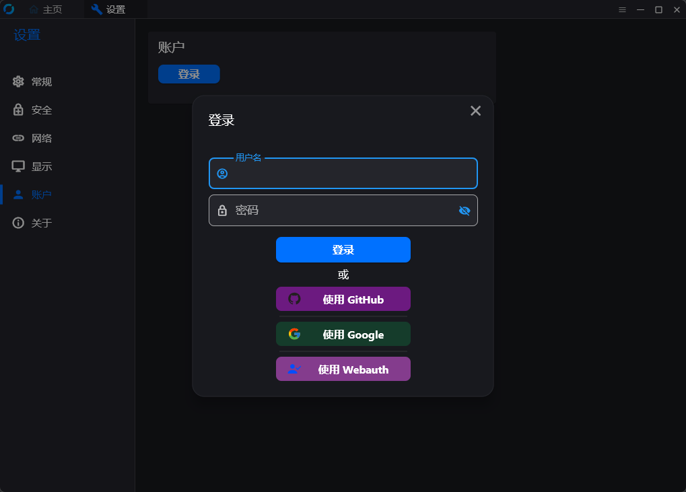
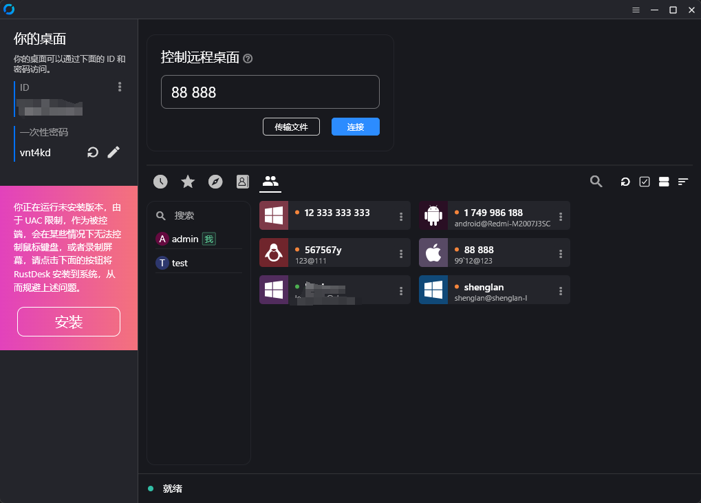
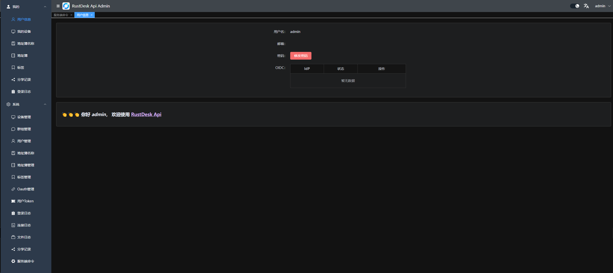

# LUODA API

> **LUODA 定制版** — 基于 RustDesk 协议的企业级远程桌面 API 管理平台

<div align=center>


</div>

---

## 项目简介

**LUODA API** 是 RustDesk 远程桌面协议的企业级 API 服务端实现（LUODA 定制版）。本项目在开源 RustDesk API 基础上进行了全面的品牌化重构，提供了：

- 🖥️ **PC 端 API** — 完整的 RESTful 接口，支持个人版和企业版
- 🎛️ **Web 管理后台** — 前后端分离的管理界面，用户/设备/群组全方位管理
- 🌐 **Web 客户端** — 无需安装客户端，浏览器即可远程连接
- 🔐 **多种认证方式** — 支持 LDAP、OAuth2 (GitHub/Google/OIDC)、JWT
- 📊 **审计日志** — 登录日志、连接日志、文件传输日志
- 🌍 **国际化** — 内置中英文等多语言支持

---

## 功能特性

### API 服务

基本实现了 PC 端基础的接口。支持 Personal 版本接口，可通过配置文件 `luoda.personal` 或环境变量 `LUODA_API_LUODA_PERSONAL` 来控制是否启用。

<table>
    <tr>
      <td width="50%" align="center" colspan="2"><b>登录</b></td>
    </tr>
    <tr>
        <td width="50%" align="center" colspan="2"></td>
    </tr>
     <tr>
      <td width="50%" align="center"><b>地址簿</b></td>
      <td width="50%" align="center"><b>群组</b></td>
    </tr>
    <tr>
        <td width="50%" align="center"></td>
        <td width="50%" align="center"></td>
    </tr>
</table>

### Web Admin

- 前后端分离，提供用户友好的管理界面
- 后台访问地址：`http://<your-server>[:port]/_admin/`
- 初次安装管理员用户名 `admin`，密码在控制台打印，可通过 CLI 更改



**管理功能：**
- 👤 用户管理（支持 LDAP/AD 集成）
- 🖥️ 设备管理与分组
- 📒 地址簿管理（支持共享）
- 🏷️ 标签管理
- 👥 群组管理（共享组 & 普通组）
- 🔗 OAuth2 集成（GitHub、Google、OIDC）
- 📝 登录日志 / 连接日志 / 文件传输日志
- 🌐 快速启动 Web Client
- 🔗 游客临时分享链接
- ⚙️ Server 指令控制（简易模式 + 高级模式）

### Web Client

1. 已登录后台用户自动登录
2. 未登录点击右上角登录即可
3. 自动同步 ID 服务器和 KEY
4. 自动同步地址簿
5. 支持 `v2 Preview` — 访问 `/webclient2`
6. 游客可通过临时分享链接直接远程

### CLI

```bash
# 查看帮助
./apimain -h

# 重置管理员密码
./apimain reset-admin-pwd <新密码>
```

---

## 快速部署

### ⭐ 方式一：1Panel 面板部署（推荐）

[1Panel](https://1panel.cn) 是新一代 Linux 服务器运维管理面板，以下是通过 1Panel 部署 LUODA API 的详细步骤。

#### 前置条件

- 已安装 [1Panel](https://1panel.cn/docs/installation/online_installation/)（要求 1Panel ≥ v1.10）
- 服务器已安装 Docker 和 Docker Compose
- 一个可用的 RustDesk Server（ID 服务器 + Relay 服务器）

#### 步骤 1：创建部署目录

在 1Panel 的「主机 → 文件」中，进入 `/opt` 目录，创建 `luoda-api` 文件夹：

```bash
mkdir -p /opt/luoda-api/data
```

#### 步骤 2：准备配置文件

在 `/opt/luoda-api/` 目录下创建 `config.yaml`：

```yaml
lang: "zh-CN"
app:
  web-client: 1
  register: false
  register-status: 1
  captcha-threshold: 3
  ban-threshold: 0
  show-swagger: 0
  token-expire: 168h
  web-sso: true
  disable-pwd-login: false

admin:
  title: "LUODA API Admin"
  hello: '<div style="text-align:center;padding:20px;"><h2 style="color:#2b85ba;">🎉 欢迎使用 LUODA API 管理后台</h2><p>高效、安全的远程管理解决方案</p></div>'

gin:
  api-addr: "0.0.0.0:21114"
  mode: "release"
  resources-path: 'resources'
  trust-proxy: ""

gorm:
  type: "sqlite"
  max-idle-conns: 10
  max-open-conns: 100

luoda:
  id-server: "你的服务器IP:21116"
  relay-server: "你的服务器IP:21117"
  api-server: "http://你的服务器IP:21114"
  key: "你的RustDesk Key"
  personal: 1

logger:
  path: "./runtime/log.txt"
  level: "info"
  report-caller: true
```

> ⚠️ 请将 `你的服务器IP` 和 `你的RustDesk Key` 替换为实际值。Key 可在 RustDesk Server 的 `id_ed25519.pub` 文件中找到。

#### 步骤 3：创建 Docker Compose 编排

在「应用商店 → 创建编排」中，或直接在 `/opt/luoda-api/` 下创建 `docker-compose.yaml`：

```yaml
version: '3'

services:
  luoda-api:
    image: luoda2023/luoda-api:latest
    container_name: luoda-api
    restart: unless-stopped
    network_mode: host
    environment:
      - TZ=Asia/Shanghai
    volumes:
      - /opt/luoda-api/config.yaml:/app/conf/config.yaml
      - /opt/luoda-api/data:/app/data
    logging:
      driver: json-file
      options:
        max-size: "10m"
        max-file: "3"
```

> 💡 如果不需要自定义配置，也可以用环境变量方式启动（详见下方环境变量参考）。

#### 步骤 4：启动服务

在 1Panel 面板中：

1. 进入「容器」→「编排」
2. 点击你创建的编排旁的「启动」按钮
3. 等待容器状态变为「运行中」

或者通过命令行：

```bash
cd /opt/luoda-api
docker-compose up -d
```

#### 步骤 5：访问管理后台

1. 打开浏览器访问 `http://<你的服务器IP>:21114/_admin/`
2. 默认用户名：`admin`
3. 初始密码在容器日志中查看：

```bash
docker logs luoda-api | grep "admin password"
```

4. **首次登录后立即修改密码！**

#### 步骤 6：配置反向代理（可选但推荐）

在 1Panel 中通过「网站」→「创建网站」→「反向代理」：

- **域名**：`luoda.yourdomain.com`
- **代理地址**：`http://127.0.0.1:21114`

> 🔒 强烈建议配置 SSL 证书（1Panel 支持一键申请 Let's Encrypt 证书）。

---

### 方式二：Docker 部署

#### Docker Run

```bash
docker run -d \
  --name luoda-api \
  --network host \
  -v /opt/luoda-api/data:/app/data \
  -v /opt/luoda-api/config.yaml:/app/conf/config.yaml \
  -e TZ=Asia/Shanghai \
  luoda2023/luoda-api:latest
```

#### 纯环境变量启动（无需配置文件）

```bash
docker run -d \
  --name luoda-api \
  --network host \
  -v /opt/luoda-api/data:/app/data \
  -e TZ=Asia/Shanghai \
  -e LUODA_API_LANG=zh-CN \
  -e LUODA_API_LUODA_ID_SERVER=192.168.1.66:21116 \
  -e LUODA_API_LUODA_RELAY_SERVER=192.168.1.66:21117 \
  -e LUODA_API_LUODA_API_SERVER=http://192.168.1.66:21114 \
  -e LUODA_API_LUODA_KEY=你的Key \
  luoda2023/luoda-api:latest
```

#### Docker Compose

创建 `docker-compose.yaml`：

```yaml
version: '3'

services:
  luoda-api:
    image: luoda2023/luoda-api:latest
    container_name: luoda-api
    network_mode: host
    environment:
      - TZ=Asia/Shanghai
      - LUODA_API_LANG=zh-CN
      - LUODA_API_LUODA_ID_SERVER=192.168.1.66:21116
      - LUODA_API_LUODA_RELAY_SERVER=192.168.1.66:21117
      - LUODA_API_LUODA_API_SERVER=http://192.168.1.66:21114
      - LUODA_API_LUODA_KEY=你的Key
    volumes:
      - /opt/luoda-api/data:/app/data
    restart: unless-stopped
```

```bash
docker-compose up -d
```

---

### 方式三：二进制直接部署

从 [Releases](https://github.com/luoda2023/luoda-api/releases) 下载对应平台的二进制包：

```bash
# 下载（以 Linux amd64 为例）
wget https://github.com/luoda2023/luoda-api/releases/latest/download/linux-amd64.tar.gz
tar -xzf linux-amd64.tar.gz
cd release

# 修改配置
vim conf/config.yaml

# 启动
./apimain
```

**systemd 服务（推荐生产环境使用）：**

```bash
# 创建服务文件
cat > /etc/systemd/system/luoda-api.service << 'EOF'
[Unit]
Description=LUODA API Server
After=network.target

[Service]
Type=simple
LimitNOFILE=1000000
ExecStart=/opt/luoda-api/apimain
WorkingDirectory=/opt/luoda-api
Restart=always
RestartSec=10
StandardOutput=append:/var/log/luoda-api/api.log
StandardError=append:/var/log/luoda-api/api.error

[Install]
WantedBy=multi-user.target
EOF

# 启用并启动
systemctl daemon-reload
systemctl enable luoda-api
systemctl start luoda-api
```

---

### 方式四：源码编译

```bash
# 1. 环境要求：Go ≥ 1.22、Node.js ≥ 18

# 2. 克隆仓库
git clone https://github.com/luoda2023/luoda-api.git
cd luoda-api

# 3. 安装 Go 依赖
go mod tidy

# 4. 编译前端（可选，如已有预编译前端可跳过）
cd resources
mkdir -p admin
git clone https://github.com/luoda2023/luoda-api-web
cd luoda-api-web
npm install && npm run build
cp -ar dist/* ../admin/
cd ../..

# 5. 编译运行
# Linux
bash build.sh
# Windows
build.bat

# 6. 运行
cd release
./apimain
```

---

## 环境变量参考

环境变量与 `conf/config.yaml` 配置一一对应，变量名前缀为 `LUODA_API`。

| 变量名 | 说明 | 默认值/示例 |
|--------|------|-----------|
| `TZ` | 时区 | `Asia/Shanghai` |
| `LUODA_API_LANG` | 界面语言 | `zh-CN`, `en` |
| `LUODA_API_GIN_API_ADDR` | API 监听地址 | `0.0.0.0:21114` |
| `LUODA_API_GORM_TYPE` | 数据库类型 | `sqlite`, `mysql` |
| `LUODA_API_MYSQL_USERNAME` | MySQL 用户名 | `root` |
| `LUODA_API_MYSQL_PASSWORD` | MySQL 密码 | — |
| `LUODA_API_MYSQL_ADDR` | MySQL 地址 | `192.168.1.66:3306` |
| `LUODA_API_MYSQL_DBNAME` | MySQL 数据库名 | `luoda` |
| `LUODA_API_LUODA_ID_SERVER` | RustDesk ID 服务器 | `192.168.1.66:21116` |
| `LUODA_API_LUODA_RELAY_SERVER` | RustDesk Relay 服务器 | `192.168.1.66:21117` |
| `LUODA_API_LUODA_API_SERVER` | 本 API 服务器地址 | `http://192.168.1.66:21114` |
| `LUODA_API_LUODA_KEY` | RustDesk 密钥 | — |
| `LUODA_API_LUODA_KEY_FILE` | Key 文件路径 | `/data/id_ed25519.pub` |
| `LUODA_API_LUODA_PERSONAL` | 启用个人版 API | `1` |
| `LUODA_API_APP_REGISTER` | 开放注册 | `false` |
| `LUODA_API_APP_WEB_CLIENT` | 启用 Web Client | `1` |
| `LUODA_API_APP_TOKEN_EXPIRE` | Token 有效期 | `168h` |
| `LUODA_API_APP_CAPTCHA_THRESHOLD` | 验证码触发阈值 | `3` |
| `LUODA_API_APP_BAN_THRESHOLD` | IP 封禁阈值 | `0`（禁用） |
| `LUODA_API_ADMIN_TITLE` | 后台标题 | `LUODA API Admin` |
| `LUODA_API_JWT_KEY` | 自定义 JWT KEY | — |
| `LUODA_API_JWT_EXPIRE_DURATION` | JWT 有效期 | `168h` |
| `LUODA_API_PROXY_ENABLE` | 启用代理 | `false` |
| `LUODA_API_PROXY_HOST` | 代理地址 | `http://127.0.0.1:1080` |

---

## LDAP 配置

LUODA API 支持通过 LDAP/AD 进行用户认证：

```yaml
ldap:
  enable: true
  url: "ldap://ldap.example.com:389"
  base-dn: "dc=example,dc=com"
  bind-dn: "cn=admin,dc=example,dc=com"
  bind-password: "password"
  user:
    base-dn: "ou=users,dc=example,dc=com"
    filter: "(cn=*)"
    username: "uid"           # AD 环境使用 "sAMAccountName"
    email: "mail"
    first-name: "givenName"
    last-name: "sn"
    sync: false
    admin-group: "cn=admin,dc=example,dc=com"
```

---

## 数据库

默认使用 SQLite，无需额外配置。如需使用 MySQL：

```yaml
gorm:
  type: "mysql"
  max-idle-conns: 10
  max-open-conns: 100

mysql:
  username: "root"
  password: "your-password"
  addr: "192.168.1.66:3306"
  dbname: "luoda"
```

---

## 常用链接

- 📖 [WIKI 文档](https://github.com/luoda2023/luoda-api/wiki)
- 🐛 [问题反馈](https://github.com/luoda2023/luoda-api/issues)
- 📦 [Release 下载](https://github.com/luoda2023/luoda-api/releases)
- 🎨 [前端源码](https://github.com/luoda2023/luoda-api-web)

---

## 端口说明

| 端口 | 协议 | 用途 |
|------|------|------|
| 21114 | TCP | LUODA API（本服务） |
| 21115 | TCP | RustDesk NAT 类型测试 |
| 21116 | TCP/UDP | RustDesk ID 服务 |
| 21117 | TCP | RustDesk Relay 服务 |
| 21118 | TCP | RustDesk WebSocket |
| 21119 | TCP | RustDesk WebClient |

---

## 鸣谢

- 本项目基于开源 [RustDesk API](https://github.com/lejianwen/rustdesk-api) 进行深度定制
- 感谢 [RustDesk](https://rustdesk.com) 团队提供优秀的远程桌面协议
- 感谢所有贡献者！

<a href="https://github.com/luoda2023/luoda-api/graphs/contributors">
  
</a>

---

<div align=center>

**⭐ 如果 LUODA API 对你有帮助，请点个 Star 鼓励一下！**

Made with ❤️ by LUODA Team | 版本 2.0.0

</div>